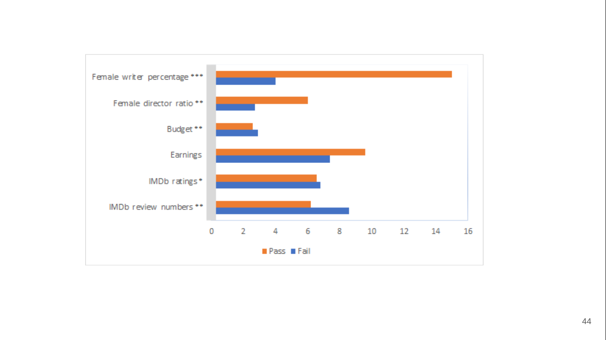
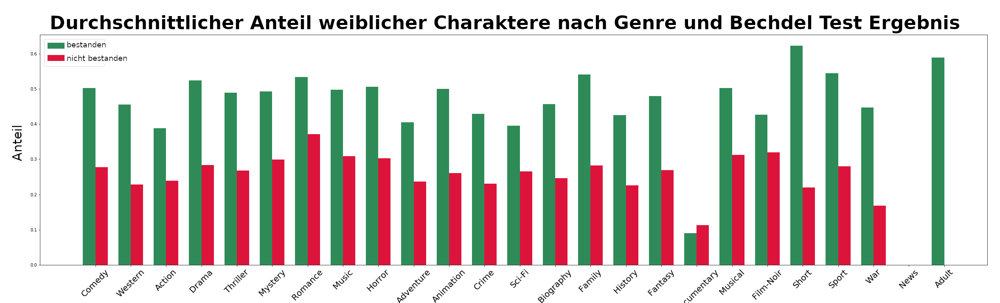

Es gibt bereits mehrere Maße und Indikatoren für Gender Bias in Filmen wie beispielsweise der [Bechdel Test](https://bechdeltest.com/), die Analyse von [Macht und Handlungsmacht (power and agency)](https://homes.cs.washington.edu/~msap/movie-bias/), und [Netzwerkmaße](https://www.nature.com/articles/s41599-020-0436-1).

Unsere Analyse für einige wenige bereits verfügbare Filmdaten (ohne die Analyse der Untertitel oder Skripte) zeigt folgende Ergebnisse:

### Bechdal Test
Der Bechdal Test gilt als bestanden, wenn in einem Film zwei namentlich benannte Frauen miteinander über etwas anderes als einen Mann reden. Für einige Filme ist das Ergebnis bereits online abrufbar. Die ersten zwei Abbildungen zeigen das Ergebnis des Bechdal Tests nach verschiedenen Kriterien. 

**Diversität in der Filmcrew macht einen Unterschied** 

**Das Genre macht einen Unterschied**

**Die Dinge entwickeln sich zum Besseren**

### Frauen sprechen deutlich weniger

Wir hoffen, dass diese Website als Ansprechadresse für verschiedene automatisch anwendbare Maße von Gender Bias auf einem großen Filmdatensatz dienen kann. Unsere detaillierte und leicht verständlich dargestellte Analyse soll Diskussionen über Diversität und Inklusion erleichtern und zugleich als Informationsquelle dienen.
