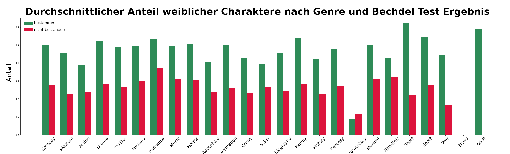
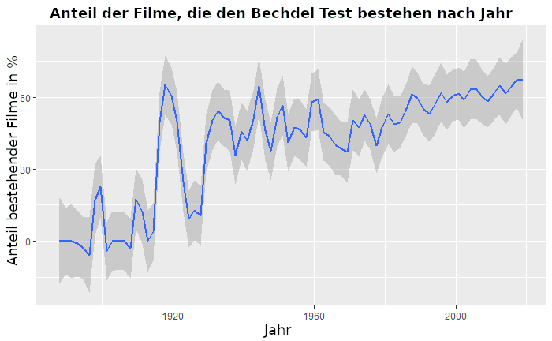
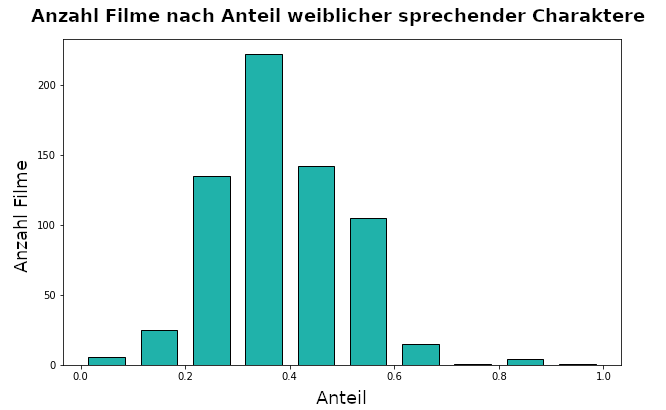

Es gibt bereits mehrere Maße und Indikatoren für Gender Bias in Filmen wie beispielsweise der [Bechdel Test](https://bechdeltest.com/), die Analyse von [Macht und Handlungsmacht (power and agency)](https://homes.cs.washington.edu/~msap/movie-bias/), und [Netzwerkmaße](https://www.nature.com/articles/s41599-020-0436-1).

Unsere Analyse für einige wenige bereits verfügbare Filmdaten (ohne die Analyse der Untertitel oder Skripte) zeigt folgende Ergebnisse:

### Bechdel Test
Der Bechdel Test gilt als bestanden, wenn in einem Film zwei namentlich benannte Frauen miteinander über etwas anderes als einen Mann reden. Ein einfacher Test, der überraschend oft nicht bestanden wird. Für einige Filme ist das Ergebnis bereits online abrufbar. Die ersten zwei Abbildungen zeigen das Ergebnis des Bechdel Tests nach verschiedenen Kriterien, die dritte die Entwicklung über die letzten Jahrzehnte. Als alleiniges Kriterium ist der Bechdel Test aber nicht dazu geeignet, Gender Bias in Filmen zu beurteilen.

**Das Genre macht einen Unterschied**
<!-- .element height="500%" width="500%" -->

Betrachtet man den relativen Unterschied von Filmen, die den Bechdel Test bestehen und solchen, die ihn nicht bestehen nach Genre, so zeigen sich einige Unterschiede. Sci-fi und Actionfilme bestehen den Bechdel Test zum Beispiel seltener als Dramen.

**Die Dinge entwickeln sich zum Besseren**
\
Der allgemeine Trend über die letzten Jahrzehnte zeigt, dass immer mehr Filme den Bechdal Test bestehen. Einzelne Ausreißer sind dadurch bedingt, dass nur wenige Filme für diese Jahre verfügbar waren.

### Frauen sprechen deutlich weniger
\
Im Durchschnitt haben Frauen in Filmen deutlich weniger als die Hälfte des Redeanteils. Das Histogramm zeigt für 10%-Schritte der Redeanteile, wie viele Filme in dieser Kategorie liegen. Die häufigste Kategorie liegt bei ca. eineme Drittel der Sprechanteile von Frauen. Ebenfalls bemerkenswert sind die Randkategorien: In den Kategorien von 0 bis 20% liegen mehr Filme als in den Kategorien von 60 bis 100%.

   

Wir hoffen, dass diese Website als Ansprechadresse für verschiedene automatisch anwendbare Maße von Gender Bias auf einem großen Filmdatensatz dienen kann. Unsere detaillierte und leicht verständlich dargestellte Analyse soll Diskussionen über Diversität und Inklusion erleichtern und zugleich als Informationsquelle dienen.
